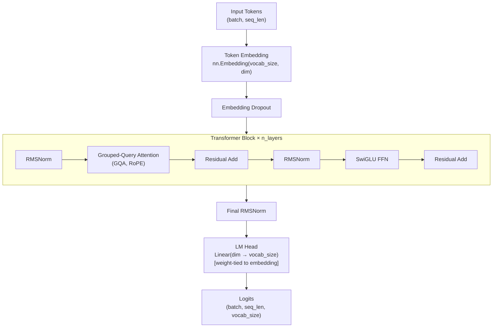
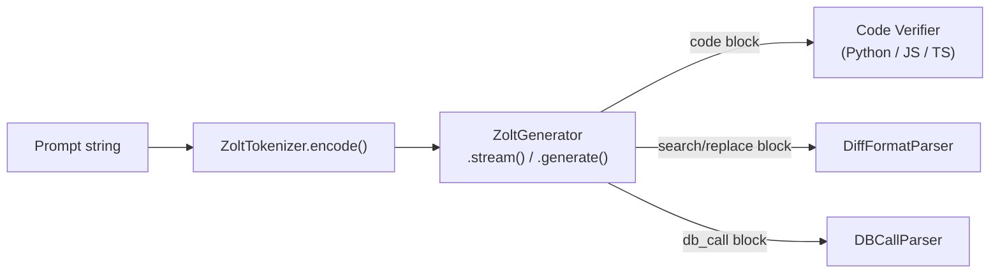
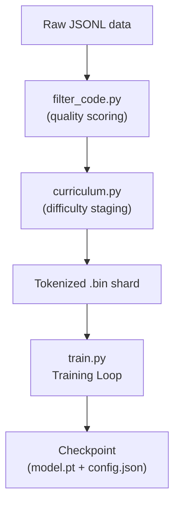
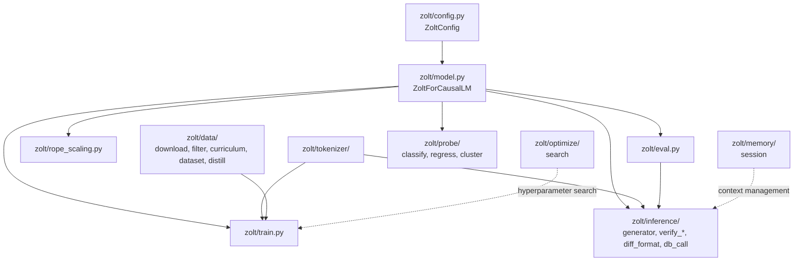

# Zolt Architecture

This document describes the technical architecture of the **Zolt** model and its
surrounding ecosystem. For a high-level overview see the [README](README.md).

---

## Table of Contents

1. [Model Overview](#model-overview)
2. [Transformer Block](#transformer-block)
3. [MatFormer Sub-Network Slicing](#matformer-sub-network-slicing)
4. [Special Tokens](#special-tokens)
5. [Tokenizer](#tokenizer)
6. [Inference Stack](#inference-stack)
7. [Training Pipeline](#training-pipeline)
8. [Data Pipeline](#data-pipeline)
9. [Probe Modules](#probe-modules)
10. [Module Dependency Map](#module-dependency-map)

---

## Model Overview

Zolt is a **decoder-only autoregressive transformer** for code generation and
structured reasoning. It follows the LLaMA/Mistral architectural family with
these key differences:

| Property | `zolt` | `zolt-mini` |
|----------|--------|-------------|
| Parameters | 250,905,600 (~251M) | 109,529,856 (~110M) |
| Layers (`n_layers`) | 24 | 20 |
| Model dimension (`dim`) | 1024 | 768 |
| Attention heads (`n_heads`) | 16 | 12 |
| KV heads (`n_kv_heads`) | 4 | 4 |
| FFN hidden dim | 3072 | 2048 |
| Vocabulary size | 32,000 | 32,000 |
| Max context length | 4,096 (extendable to 16,384) | 4,096 |

Both sizes are **extractable sub-networks of a single MatFormer-trained
checkpoint** — not separate models.

---

## Transformer Block



### RMSNorm

Root Mean Square Layer Normalization (no centering bias):

```
RMSNorm(x) = x / RMS(x) * γ,  where RMS(x) = sqrt(mean(x²) + ε)
```

`ε = 1e-6`, learnable scale `γ` initialized to 1.

### Grouped-Query Attention (GQA)

- Query heads: `n_heads` (16 for `zolt`, 12 for `zolt-mini`)
- Key/Value heads: `n_kv_heads = 4` (shared across query groups)
- Head dimension: `dim // n_heads = 64`
- KV heads are expanded to match query heads via repeat-interleave before
  computing scaled dot-product attention

**Rotary Position Embeddings (RoPE):**

Frequencies are precomputed as `θ_i = base^(-2i/d)` (`base = 10000`).
Applied to queries and keys before attention. Supports two scaling modes:

| Mode | Formula | Use case |
|------|---------|---------|
| Linear | `freq / scale_factor` | Moderate context extension |
| NTK-aware | `base' = base * (scale_factor ^ (d/(d-2)))` | Long-context fine-tuning |

### SwiGLU FFN

```
FFN(x) = W₂(SiLU(W₁x) ⊙ W₃x)
```

- `hidden_dim = (8/3) * dim`, rounded to nearest multiple for hardware
  alignment.
- Supports **active-dimension slicing** for MatFormer sub-network extraction.

---

## MatFormer Sub-Network Slicing

Zolt is trained with the **MatFormer** objective, which jointly optimizes
nested sub-networks within a single checkpoint.

```
Full model dim: 1024
    └── zolt slice (active_dim=1024)  → 250.9M params
    └── zolt-mini slice (active_dim=768) → 109.5M params
```

During inference, setting `active_dim < dim` slices the first `active_dim`
rows/columns of every weight matrix:

```python
# Extract zolt-mini from a zolt checkpoint
model = ZoltForCausalLM.from_pretrained("path/to/zolt")
output = model(input_ids, active_dim=768)
```

This works because MatFormer training enforces that each prefix sub-matrix
is independently capable — no additional fine-tuning required.

---

## Special Tokens

Zolt uses **23 special tokens** covering structured generation and tool use.
These are **not branding** and must not be renamed.

| Token | ID | Purpose |
|-------|----|---------|
| `<pad>` | 0 | Padding |
| `<bos>` | 1 | Begin of sequence |
| `<eos>` | 2 | End of sequence |
| `<unk>` | 3 | Unknown token |
| `<think>` / `</think>` | 4–5 | Chain-of-thought reasoning block |
| `<tool_call>` / `</tool_call>` | 6–7 | Structured tool invocation |
| `<tool_response>` / `</tool_response>` | 8–9 | Tool result injection |
| `<code>` / `</code>` | 10–11 | Inline code block |
| `<\|im_start\|>` / `<\|im_end\|>` | 12–13 | Chat message boundaries |
| `<FILL>` | 14 | Fill-in-the-middle (FIM) placeholder |
| `<PREFIX>` | 15 | FIM prefix marker |
| `<SUFFIX>` | 16 | FIM suffix marker |
| `<search>` | 17 | Diff: section to replace |
| `<replace>` | 18 | Diff: replacement content |
| `<diff_end>` | 19 | Diff: block terminator |
| `<uncertain>` | 20 | Epistemic uncertainty marker |
| `<db_call>` / `</db_call>` | 21–22 | Structured database query |

---

## Tokenizer

`ZoltTokenizer` wraps a BPE tokenizer (HuggingFace `tokenizers` library) with:

- Vocabulary size: 32,000 subword tokens + 23 special tokens
- Pre-tokenization: byte-level fallback for robustness
- Training corpus: code-heavy multilingual text (StarCoder-style)
- Special tokens are inserted **before** BPE training and given fixed IDs

Training a new tokenizer from scratch:

```bash
python -m zolt.tokenizer.train_tokenizer \
    --data-dir data/raw/ \
    --vocab-size 32000 \
    --output zolt_tokenizer.json
```

---

## Inference Stack



### `ZoltGenerator`

- **`stream(prompt_ids, ...)`** — yields tokens one-by-one (generator)
- **`generate(prompt, max_new_tokens, ...)`** — returns full string
- Sampling: temperature + top-p (nucleus) + top-k
- Stops on `<eos>` or `<|im_end|>`
- MatFormer: pass `active_dim` to transparently use a smaller sub-network
- Entropy-based uncertainty: if token entropy exceeds `entropy_threshold`,
  wraps factual claims in `<uncertain>...</uncertain>`

### Self-Correcting Code Generation

`verify_base.self_correcting_generate()` implements a retry loop:

```
generate → verify → [pass] → return
                  → [fail] → inject error into prompt → retry (max n times)
```

Checkers:
- **Python**: `ast.parse` + optional `mypy` type check
- **JavaScript**: Node.js subprocess (falls back to heuristic)
- **TypeScript**: `tsc --noEmit` subprocess (falls back to JS heuristic)

---

## Training Pipeline



### Training Loop (`zolt/train.py`)

| Feature | Detail |
|---------|--------|
| Optimizer | AdamW (`β₁=0.9`, `β₂=0.95`, `ε=1e-8`) |
| LR schedule | Cosine decay with linear warmup |
| Gradient clipping | `max_norm=1.0` |
| Loss | Cross-entropy on next-token prediction |
| Mixed precision | `torch.cuda.amp` (when CUDA available) |
| Gradient accumulation | Configurable `accum_steps` |
| Checkpointing | Every N steps; saves `model.pt` + `config.json` |
| MatFormer | Optional nested-dim training loss |
| Curriculum | Starts on easy examples, progresses to hard |
| Distillation | Soft-label mixing from teacher model logits |

---

## Data Pipeline

```
zolt/data/
├── download.py       # StarCoder / HuggingFace dataset download
├── filter_code.py    # Quality scoring (line length, comment ratio, etc.)
├── curriculum.py     # Difficulty-based example staging
├── dataset.py        # Token shard Dataset and DataLoader
├── distill.py        # Teacher–student soft-label generation and mixing
├── db_call_synth.py  # Synthetic <db_call> examples from SQL schemas
└── pipeline.py       # End-to-end orchestration script
```

### Quality Scoring (`filter_code.py`)

Each file is scored on:
- Average line length
- Comment-to-code ratio
- Presence of meaningful identifiers
- Absence of auto-generated or minified code patterns

Files below the quality threshold are discarded before tokenization.

---

## Probe Modules

Zolt ships lightweight diagnostic probes that operate on frozen embeddings
obtained via `ZoltForCausalLM.encode()` (default: `pool='last'`).

| Probe | Module | Purpose |
|-------|--------|---------|
| `ClassificationProbe` | `zolt/probe/classify.py` | Intent / label classification |
| `RegressionProbe` | `zolt/probe/regress.py` | Code quality / complexity scoring |
| `KMeansCluster` | `zolt/probe/cluster.py` | Unsupervised embedding clustering |

All probes support `.fit()`, `.predict()`, `.save()`, and `.load()`.

`KMeansCluster` uses **cosine-distance K-means++** initialization for stable
convergence without GPU requirements.

---

## Module Dependency Map



Solid lines = hard imports. Dashed lines = optional/indirect dependency.
